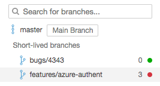
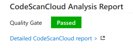
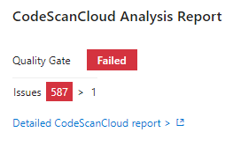

**[CodeScan Cloud][sc]** is a tool for maintaining Code Quality in your Salesforce projects. It is a static source code analysis solution that enables continuous tracking of bugs, code smells and vulnerabilities for various Salesforce languages like Apex, VisualForce, Lightning, etc, ...

## About the CodeScan Cloud VSTS Marketplace Extension
This extension provides the following features:
* A dedicated **CodeScan Cloud EndPoint** to set the user token and validate the connection.
* Three build tasks to get your projects analyzed easily:
  * **Prepare Analysis Configuration** task, to configure all the required settings before executing the build. This task is mandatory. In case of .NET solutions or Java projects, this tasks helps to integrate seamlessly with MSBuild, Maven and Gradle tasks.
  * **Run Code Analysis** task, to actually execute the analysis of the source code. Not required for Maven or Gradle projects.
  * **Publish Quality Gate Result** task, to display the quality gate status in the build summary. This tasks is optional, as it can increase the overall build time.
* Analysis of the branches and the **pull requests** of your projects
* A **widget** to monitor the quality gate for your projects on your favorite VSTS dashboard

## Highlighted Features
### Seamless Integration with Salesforce
The analysis of Salesforce is really straightforward since it only requires adding the two **Prepare Analysis Configuration** and **Run Code Analysis** tasks to your build definition.

### Branch and Pull Request analysis
Whatever type of source repository you are analysing, when a build is run on a branch of your project, the extension 
automatically configures the analysis to be pushed to the relevant project branch on CodeScan Cloud:

### Quality Gate Status

#### In the build summary
The **Publish Quality Gate Result** task waits for the analysis report to be consumed by the CodeScan Cloud in order to flag the build job with the Quality Gate status. The Quality Gate is a major, out-of-the-box, feature of CodeScan Cloud. It provides the ability to know at each analysis whether an application passes or fails the release criteria. In other words it tells you at every analysis whether an application is ready for production "quality-wise".

Example of a passing Quality Gate:

Example of a failing Quality Gate:

This [Get Started][getstarted] guide provides all the required documentation for you to setup a build definition.

   [sc]: <https://app.codescan.io>
   [getstarted]: <http://www.code-scan.com/cloud/install-configure-scanner-tfs-ts>
